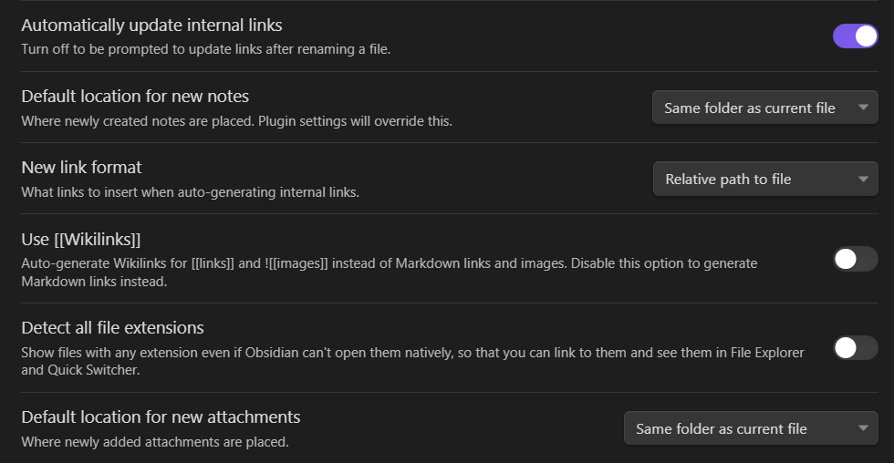

Obsidian известен как популярное и очень гибкое решение для ведения заметок, но впринципе никто не ограничивает его сферу применения одними только заметками. Он просто мощный и удобный редактор для Markdown. 
Решил в этой статье актуализировать свою конфигурацию Obsidian для удобного и самодостаточного ведения блога или любого другого статичного сайта.

В целом есть 4 компонента, которые нужно один раз настроить под себя:
- Obsidian - мощный редактор для Markdown файлов
- Hugo - фреймворк для построения сайта из Markdown-файлов. Базовая настройка [описывалась ранее](../2022-10-28-hugo/index.md)
- GitHub Actions - автоматизация, которая будет запускать на каждый коммит Hugo для сборки новой версии сайта
- GitHub Pages - халявный хостинг для экспериментов и заметок

В Obsidian открываем директорию с настроенным Hugo-шаблоном как хранилище (Vault), он создаёт в ней поддиректорию `.obsidian` со своей конфигурацией и плагинами специфичными для этого хранилища. В итоге у нас в системе контроля версий будет храниться контент, шаблоны Hugo и стили сайта, конфигурация для развёртывания и конфигурация редактора Obsidian. Общая структура выглядит так

```
$ tree -L 2 -d -a
.
├── .git
├── .github  - GitHub Actions
│   └── workflows
├── .obsidian  - настройки и плагины Obsidian для этого Vault
│   └── plugins
├── archetypes
├── content  - контент
│   └── posts
├── data
├── layouts
├── static
├── templates  - шаблоны для Obsidian
└── themes
    └── m10c
```

## Настройки

Пути к картинкам и прочим файлам должны быть относительными и максимально соответствовать соглашениям Markdown чтобы они нормально конвертировались для статичного сайта, картинки и аттач есть смысл хранить вместе со статьёй, тогда всё это проще менеджить и переносить. Wikilinks не сконвертируются в нормальные ссылки, да и в целом менее удобны для меня. Примерно так



Так же в `Core plugins` включаем Templates и указываем директорию для шаблонов


Шаблон `templates/post-template.md`
```
---
title: PAGE TITLE
description: PAGE DESCRIPTION
date: {{date}} {{time:HH:mm:ss Z}}
categories: blog
layout: post
tags: []
---

```


Теперь можно писать статьи. Я придерживаюсь следующей структуры: создаётся директория `content/posts/YYYY-MM-DD-some-title` , в ней создаётся `index.md` , вставляется шаблон страницы, добавляется содержимое статьи и туда же складываются все картинки и прочие файлы к статье. В таком виде всё отлично видно в любом ПО работающим с Markdown, включая VS Code и всякие WebIDE на GitHub/GitLab. Структура практически совпадает со статичным сайтом который сгенерируется и для этой статьи выглядит следующим образом
```
└── content
    └── posts
        └── 2023-08-24-obsidian-to-hugo
            ├── Obsidian_20230824_165731_siGv.png
            ├── Obsidian_20230824_165922_wxWu.png
            ├── Pasted image 20230824205624.png
            └── index.md
```
