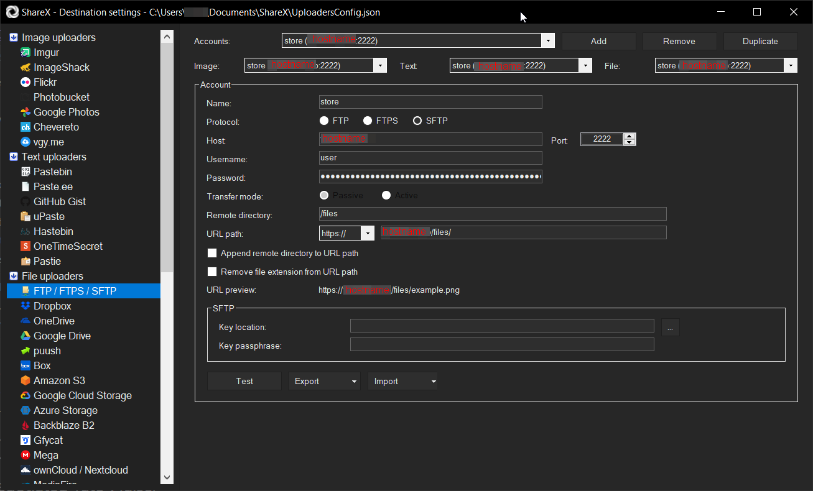

Простейший собственный хостинг для загрузки из [ShareX](../2022-10-29-sharex/index.md) можно поднять в Docker.
Для примера у меня запущен стандартный nginx в режиме простого файл-сервера, настроен раздавать статичный контент из директории ./html/ . Трафик на него по заданному HOSTNAME раскидывает балансировщик [nginx-proxy](https://hub.docker.com/r/nginxproxy/nginx-proxy) . Я решил что буду заливать файлы из ShareX в поддиректорию ./html/files/ которая будет доступна из Инета как HOSTNAME/files/ . 

В качестве SFTP-сервера будет выступать образ [linuxserver/docker-openssh-server](https://github.com/linuxserver/docker-openssh-server)
Можно было бы авторизоваться автоматом по ключам пользователя, например указав в PUBLIC_KEY_URL ключ пользователя на гитхабе, но ShareX на данный момент ещё не умеет загружать ключи из SSH-агента, поэтому приходится включить PASSWORD_ACCESS и задать уникальный USER_PASSWORD для загрузки файлов.
```yaml
services:
    site:
        image: nginx:latest
        volumes:
            - ./html:/usr/share/nginx/html
        environment:
            - VIRTUAL_HOST=HOSTNAME
            - LETSENCRYPT_HOST=HOSTNAME
            - LETSENCRYPT_EMAIL=admin@HOSTNAME
        restart: always

    ssh-server:
      image: lscr.io/linuxserver/openssh-server:latest
      container_name: openssh-server
      hostname: openssh-server #optional
      environment:
        #- PUID=1000
        #- PGID=1000
        #- TZ=Etc/UTC
        #- PUBLIC_KEY=yourpublickey #optional
        #- PUBLIC_KEY_FILE=/path/to/file #optional
        #- PUBLIC_KEY_DIR=/path/to/directory/containing/_only_/pubkeys #optional
        - PUBLIC_KEY_URL=https://github.com/USERNAME.keys #optional
        - SUDO_ACCESS=false #optional
        - PASSWORD_ACCESS=true #optional
        - USER_PASSWORD=pass #optional
        #- USER_PASSWORD_FILE=/path/to/file #optional
        - USER_NAME=user #optional
        - LOG_STDOUT= #optional
      volumes:
        - ./cont-init.d/:/custom-cont-init.d:ro
        - ./html/files:/files
      ports:
        - 2222:2222
      restart: unless-stopped
```

Так же во избежание казусов создаём файл `cont-init.d/nologin` 
в котором отключаем возможность логина в консоль, нас интересует только SFTP-сервер.
```shell
#!/usr/bin/with-contenv bash

echo Disable shell
chsh -s /sbin/nologin user
```

Остальные опции по умолчанию выключены в `/etc/ssh/sshd_config`
```
AllowTcpForwarding no
GatewayPorts no
X11Forwarding no
```

Выглядит достаточно безопасно. Для счастья не хватает только CREATE ONLY прав, так как обновление/удаление/листинг/выполнение нам из ShareX не нужны.

Ну и перенести всё из секции environment в [.env](https://docs.docker.com/compose/environment-variables/set-environment-variables/)

Настраиваем ShareX, радуемся

